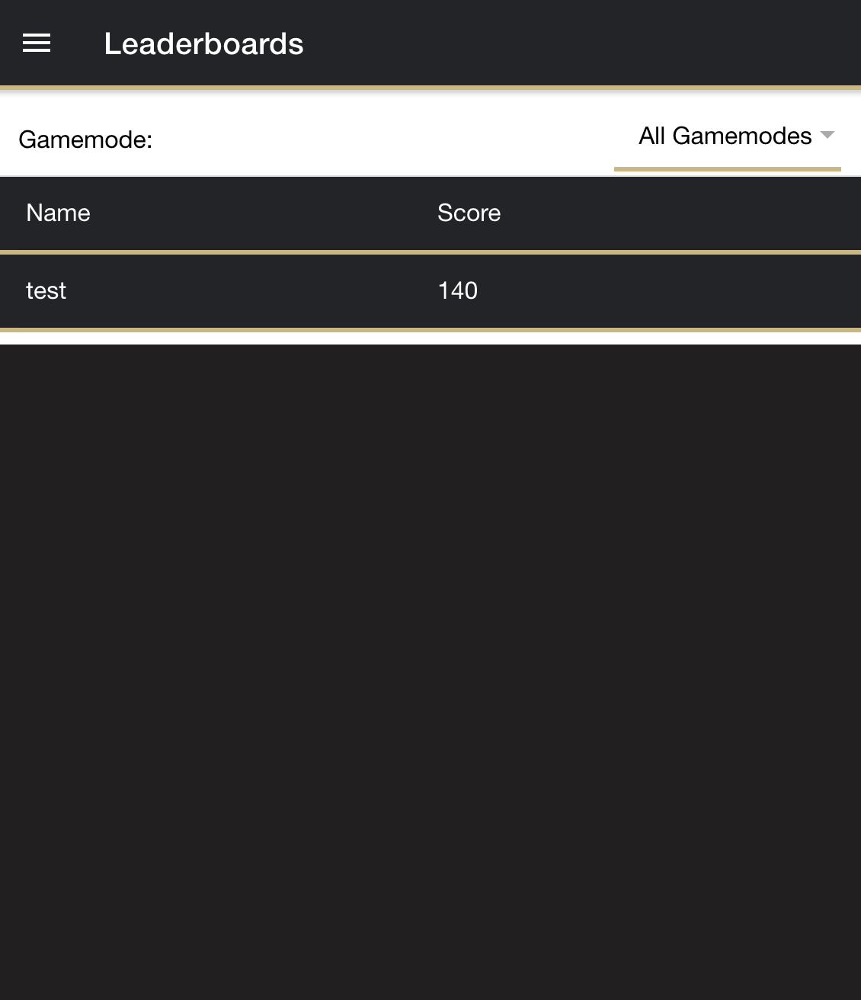

# Leaderboard Documentation

At the time of writing, a fully functioning leaderboard has been implemented which allows users to view the rankings for each of the different gamemodes. A screenshot of the current leaderboard design is shown here:



In this example, there is only one name on the leaderboard for testing purposes, but in the production application, as users complete their tasks and accumulate points, more and more users will be shown here, in decreasing order of score of course. There is currently no limit to the number of players that can be displayed here.

The "All Gamemodes" selection on the leaderboard currently displays the user's total score accumulated across all gamemodes/minigames, over the entire duration of their usage of the app.

As one would expect, the dropdown menu contains the names of other minigames/gamemodes which one can select. When a new minigame is selected, the leaderboard will update to display the users who have recieved the highest scores in a *single run* of the minigame. This is contrary to the 'All Gamemodes' leaderboard, which as stated above, tracks a users total lifetime accumulated points.

# Leaderboard Implementation Details

## Front-end Details

The frontend code for the leaderboard resides in ```front-end/src/app/leaderboaord``` and consists of the standard Angular files that are generated when running ```ionic generate page```. The code which updates the leaderboard state is fairly simple, it simply sends a request to the backend API to get the current leaderboard information when the page first loads, and when a new selection is made in the dropdown menu. It then populates the row information in the main leaderboard table.

## Backend API and Business Logic Details

The API for the leaderboard consists of a single endpoint: ```/getHiscores``` which takes in POST requests containing a single field in the request body: ```gamemode```, which instructs the backend which query to build in order to retrieve the proper hiscores. All helper functions for the backend leaderboard code are found in ```leaderboard.js```.

### SQL Queries

When a client sends a request to the hiscores API endpoint, the backend API service executes various different SQL statements to retrieve the appropriate hiscores list depending on what gamemode has been selected in the dropdown.

If any single gamemode has been selected, the following SQL query is used:

```SELECT users.username, day.gamemode FROM users, day WHERE day.userid = users.userid AND day.gamemode >= 0 ORDER BY day.gamemode DESC;```

The SQL executed here is fairly straightforward; it simply selects the score for the selected gamemode, and the username associated with the score from the users and day table for each row, and returns the rows in descending order of score.

One small note here, the backend API replaces instances of ```day.gamemode``` with the appropriate column name depending on the gamemode selected. This should be safe from SQL injection, as the backend service ensures that the gamemode name passed in the API request is one of the valid gamemode column names present in the ```day``` table before adding this to the SQL statement.

On the otherhand, when the __*All Gamemodes*__ option is selected, the SQL executed to retrieve the hiscores list is quite different.

At the time of writing, the __*All Gamemodes*__ section of the leaderboard displays the top users who have accumulated the highest total number of points on the service throughout their entire account's existence, across all minigames. We thought this would be an interesting way to go about this section, as it is fairly easy to get a perfect score on any given day, so this implementation makes it more interesting by also tracking how many times a given user comes back to do training. The more days they train, the higher their position on this leaderboard becomes. We hope that this will help with the goal of increasing user retention, by encouraging users to come back every day and do training.

The SQL executed for __*All Gamemodes*__ is as follows:

```SELECT users.username, SUM(day.nameface + day.whosnew + day.shuffle + day.memory) AS max_score FROM users, day WHERE day.userid = users.userid GROUP BY users.username ORDER BY max_score DESC;```

This SQL statement sums all the scores for each of the gamemodes into a single column called ```max_score```, and then also selects the username associated with the row in the ```day``` table being aggregated upon, via the SUM function. Then, the GROUP BY clause sums the max_score for all the rows belonging to a given user, giving us the total points a user has accumulated to date, and the ORDER BY clause orders the results in descending order of total score. This gives us an ordered list for use in the hiscores.

### Final Notes

The nice thing about handling the sorting and aggregation on the SQL/Database side is that the front-end is kept as dumb as possible, it merely gets a list of rows from its API call, and populates a table with the list of rows as they were output. Additionally, the rows displayed in the leaderboard can be very easily changed simply by modifying these SQL statements, and the front-end leaderboard code will display the rows in the order that the new SQL statement spits them out. This is powerful, but one must be aware that changing this SQL will modify the order in which results are displayed in the front-end application, as at the time of writing, there is no additional sorting or operating on the data that the database returns.


