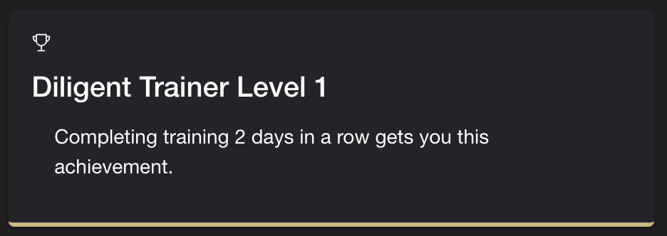

The addition of adding achievments to user accounts involved additions to the PostgreSQL database schema,
backend functions and API endpoints, and additional functions/pages added to the front-end applicaiton to display this information to the end users.

# Achievmenent Database Table Schema:

The feature involved adding a new "achievments" table to the PostgreSQL database, with column descriptions shown in the creation statement below:
```
    CREATE TABLE 
        achievements 
        (
            userid INT, 
            achievement_title TEXT,
            achievement_description TEXT NOT NULL,
            PRIMARY KEY(achievement_title, userid)
        );
```
This table contains the titles and description for each achievement belonging to individual users.
In order to ensure that each user only poseses 1 row corresponding to a particular achievment, the primary key of each column 
is comprised of a userid and the achievement title.

# Additional API Endpoints Added/Changes to Backend

As far as work done on the backend, functionality was put in place to add an achievement to a user account, 
and an API endpoint was created to retrieve the acheivment data associated with a particular user.

The current system is very extensible, and allows for new achievment types to be added very easily.
    
## Process for adding an achievment:

For consistency and ease of adding new achievements as they come up, we have created an ```achievmentConstants.js``` file in the backend application which contains two exports: achievmentTitles, and achievmentDescriptions. 
These objects contain key->value pairs which correspond to achievment name->achievment title, and achievment name -> achievement description.

To add a new achievment type that can be added using the existing API, you must add the description and title to these constant maps with the same key.
At the time of writing, the maps look like this:
```
achievementTitles: {
    TWO_DAYS_IN_A_ROW: "Diligent Trainer Level 1",
    THREE_DAYS_IN_A_ROW: "Diligent Trainer Level 2",
    FOUR_DAYS_IN_A_ROW: "Diligent Trainer Level 3",
    FIVE_DAYS_IN_A_ROW: "Diligent Trainer Level 4"

}

achievementDescriptions: {
    TWO_DAYS_IN_A_ROW: "Completing your training two days in a row earns you this achievement.",
    THREE_DAYS_IN_A_ROW: "Completing your training three days in a row earns you this achievement.",
    FOUR_DAYS_IN_A_ROW: "Completing your training four days in a row earns you this achievement.",
    FIVE_DAYS_IN_A_ROW: "Completing your training five days in a row earns you this achievement."
}
```
For example, if I wanted to add a new achievement type for getting a perfect score on "Who's New", I would edit the maps like so:

```
achievementTitles: {
    TWO_DAYS_IN_A_ROW: "Diligent Trainer Level 1",
    THREE_DAYS_IN_A_ROW: "Diligent Trainer Level 2",
    FOUR_DAYS_IN_A_ROW: "Diligent Trainer Level 3",
    FIVE_DAYS_IN_A_ROW: "Diligent Trainer Level 4",
    PERFECT_SCORE_WHOS_NEW: "New Face Expert"
}

achievementDescriptions: {
    TWO_DAYS_IN_A_ROW: "Completing your training two days in a row earns you this achievement.",
    THREE_DAYS_IN_A_ROW: "Completing your training three days in a row earns you this achievement.",
    FOUR_DAYS_IN_A_ROW: "Completing your training four days in a row earns you this achievement.",
    FIVE_DAYS_IN_A_ROW: "Completing your training five days in a row earns you this achievement.",
    PERFECT_SCORE_WHOS_NEW: "Getting a perfect score in "Who's New" earns you this achievement."
}
```

Notice that the new rows share the same key.


To add an achievment to a user account, simply call the function ```addAchievement(userid, achievement_title_key)```
which is found in ```achievemnts.js``` in the backend code, passing in the userid that you want to give the achievment to, 
and the achievment_title_key (the key from the constant maps above) which corresponds to the achievment that you want to issue.
The way this was done to implement the current X days in a row achievments was to check how many days in a row the user had played once finishing training, and if they earned an achievement, simply call addAchievement.

For example, if I wanted to add FIVE_DAYS_IN_A_ROW to userid 5, after doing the necessary logic checks to verify they earned the achievment,
I would issue it with this function call: ```addAchievement(5, FIVE_DAYS_IN_A_ROW)```.


# GetAchivements API Structure:

To get the achivements associated with a user account, submit a POST request to "/get_achievments" in the backend service.
The request only needs to contain a JWT, which is parsed to get the user who's achievements must be retrieved.

The response structure is as follows:
```
    {
        result: [
            {
                userid: ...,
                achievment_title: ...,
                achievement_description: ...
            },
            {
                userid: ...,
                achievment_title: ...,
                achievement_description: ...
            },
            ...
        ]
    }
```

# Achievements Frontend Appearance

Currently, there is a fairly simple but effective Achievements page implemented in the hamburger menu on the main application screen. The page fetches all the achievements for the logged in user via the API endpoint above, and populates the page with cards containing the Achievement Title and Description, as shown below:

 


