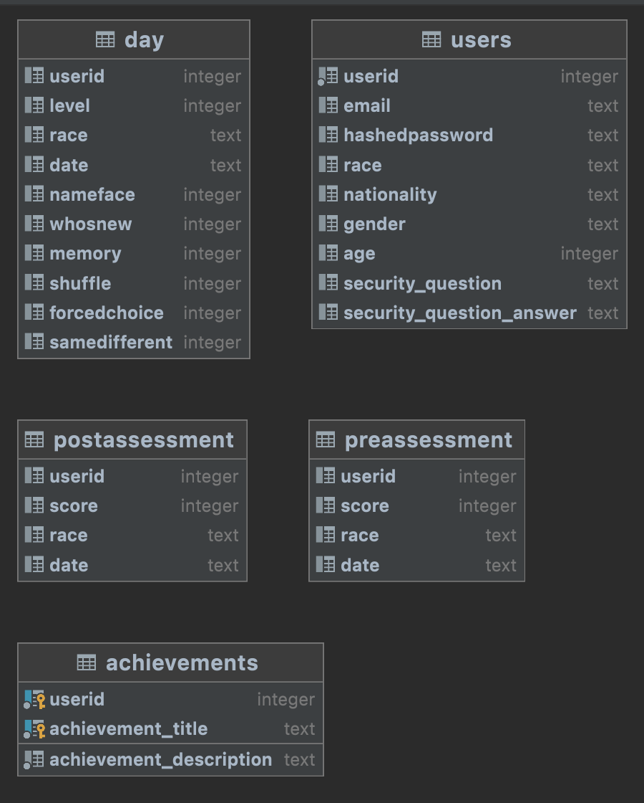

# Database Design and Schema

Currently, the database for the application is a PostgreSQL instance, consisting of 5 tables as shown in the image below:



The tables are related to one another through the ```userid``` column, which serves to tie a particular user record in the users table to each row in the other tables.

## Table Descriptions

## 1. Users Table

As the name suggests, rows in the ```users``` table holds account information for each user account that has been registered in the application.

### Column Information

- ```userid``` - a serially generated unique integer serving as a primary key for the users table.

- ```email``` - a text column holding the email associated with the user, converted to all lower case characters.

- ```hashedpassword``` - a text column holding the users hashed password

- ```race``` - a text column holding the race of the user

- ```nationality``` - a text column holding the country of origin of the user

- ```gender``` - a text column holding the gender of the user

- ```age``` - an integer column holding the age of the user at time of registration (is not updated as time passes)

- ```security_question``` - a text column holding the security question that the user provided an answer to on registration (value of this column is retrieved later to populate the UI with the user's security question during account recovery)

- ```security_question_answer``` - a text column holding the hashed security question answer (converted to lowercase) that the user provided on registration. This value is checked against the converted-to-lowercase answer a user provides when trying to recover their account.

## 2. Day Table

Rows in the ```day``` table contain scores that a particular user recieved on each of their training minigames on a given training day, as well as additional information about that training session. Note: the samedifferent and forcedchoice gamemodes are part of the daily assessment (taken after completing daily training), which at the time of writing has been removed.

### Column Information

- ```userid``` - the userid of the user account/row in the user table associated with the training record the row represents (integer)

- ```level``` - the level (day) of training that the training session was for (integer)

- ```race``` - the race that was trained on during the training session (text)

- ```nameface``` - the score recieved on the nameface minigame (integer)

- ```whosnew``` - the score recieved on the whosnew minigame (integer)

- ```memory``` - the score recieved on the memory minigame (integer)

- ```shuffle``` - the score recieved on the shuffle minigame (integer)

- ```forcedchoice``` - the score recieved on the forcedchoice section of daily assessment, currently removed (integer) 

- ```samedifferent``` - the score recieved on the samedifferent section of daily assessment, currently removed (integer)

## 3. Achievements Table

Rows in the ```achievements``` table contain information about an achievement that a given user has earned. The primary key of a row in this table is a combination of the ```userid``` column and the ```achievement_title``` column, to ensure that a user only has one record in the table pertaining to a particular achievement. This table is currently used to retrieve all of the achievements a given user has earned, to display it to them on the achievements page in the application.

### Column Information

- ```userid``` - the userid of the user account that is associated with the given achievement record (integer, part of primary key)

- ```achievement_title``` - the title of the particular achievement that the user has earned (text, second part of primary key)

- ```achievement_description``` - the description of the given achievement, shows up in the achievement card for a given achievement on the user's profile


## 4. Preassessment Table

Rows in the ```preassessment``` table contain information about a given user's performance on the preassessment they took through the app prior to beginning their daily training. At the time of writing, the preassessment has since been removed from the application as the current implementation is far too tedious, but the table description has been provided in the event that it needs to be reimplemented.

### Column Information

- ```userid``` - integer linking the row to a user account
- ```score``` - integer representing the user's score on the assessment
- ```race``` - the race of faces that were tested on during the assessment
- ```date``` - the date the assessment was taken

## 5. Postassessment Table

Very similar to the preassessment table, rows in the ```postassessment``` table contain information about a given user's performance on the postassessment they took after completing their full circuit of training. The postassessment has also been removed as it is too tedious for the users in its current state, but the table information has been provided in the event it needs to be reimplemented.

### Column Information

- ```userid``` - integer linking the row to a user account
- ```score``` - integer representing the user's score on the assessment
- ```race``` - the race of faces that were tested on during the assessment
- ```date``` - the date the assessment was taken

# Current Method of Database Creation/Updating Schema and Improvements Made

The current state of the database initialization strategy was implemented by prior teams working on the project, and is quite a strange way of doing things compared to how the 2021-2022 team has handled database creation on other project. Currently, SQL scripts for initialization have been written as in-line SQL within the ```initializeDB.js``` Javascript file. On startup of the backend API service, this initialize script runs, which essentially checks to see if each of the tables shown in the schema above exist. If one of them is missing, the script adds the table to the database using the SQL creation string for said table provided in the initialization file. This works okay if a developer needs to add an entirely new table, but if for example a single new column needs to be added to an already existing DB table, there is no clean way to do so within the current 'initialize DB' script. Additionally, running this script to check if the database is initialized every single time the backend service starts up is rather inefficient, initializing the DB should be an entirely separate step in development. Moreover, having the SQL statements which initialize the DB in string variables within the backend code is a very unclear and cryptic way of defining schema. 

The 2021-2022 team has made a few improvements to try and make this database creation process more streamlined and understandable. Firstly, they extracted the CREATE TABLE SQL statements from the ```initializeDB.js``` file and put them in a separate ```initializeDB.sql``` file, to provide future developers with a clearly defined place to view the database creation SQL. Additionally, while we kept the DB intialization process on service startup (we did not want to tamper with the current process to heavily), we cleaned up the script to organize the checks for each table initialization more cleanly.

In the future, common practice dictates that a SQL script be written to backup any existing data in the database, drop and recreate the tables as needed, and then restore the data.


